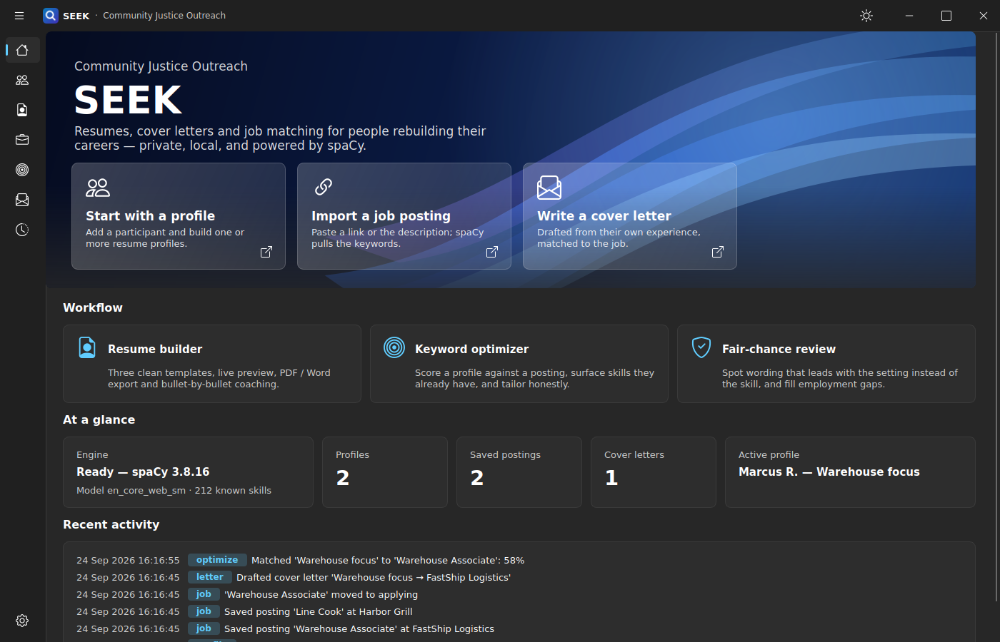
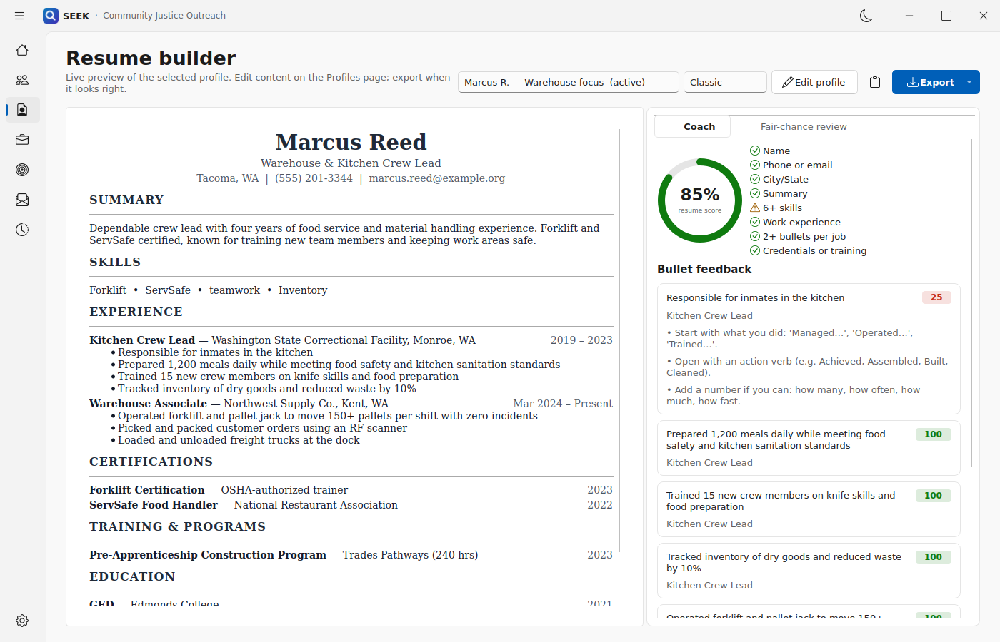
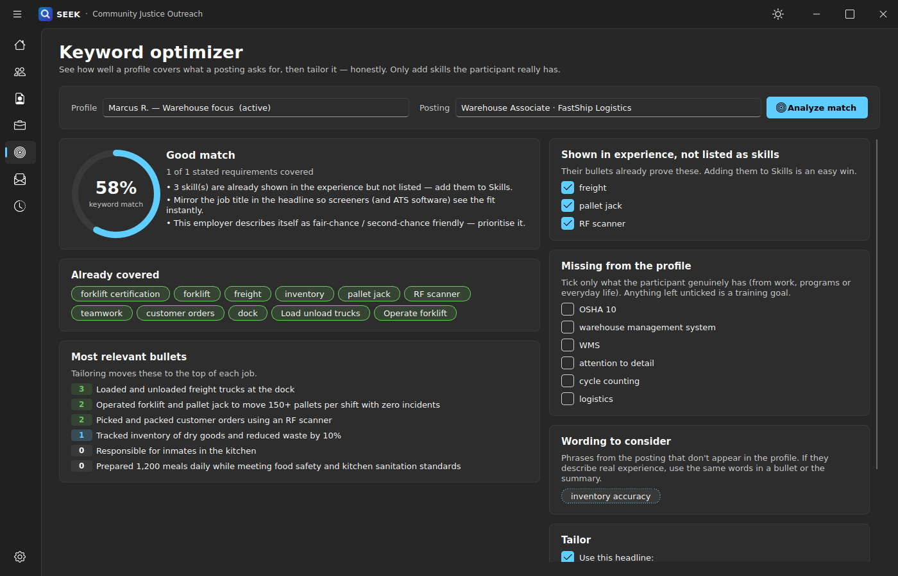
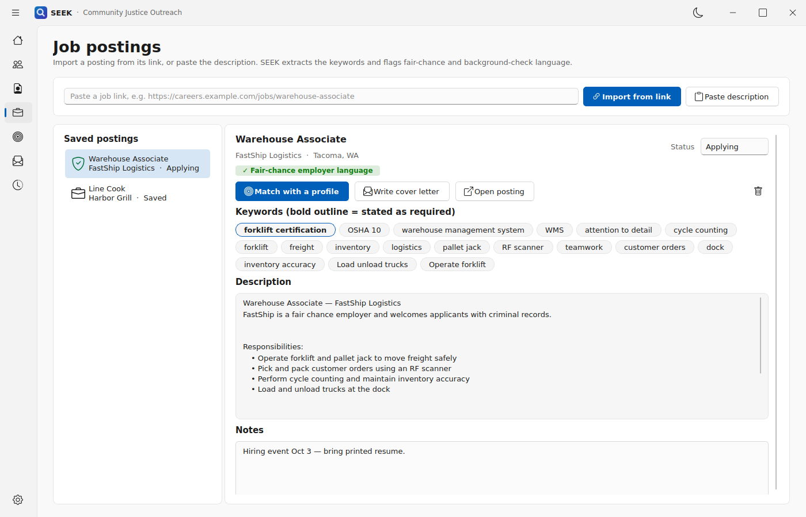
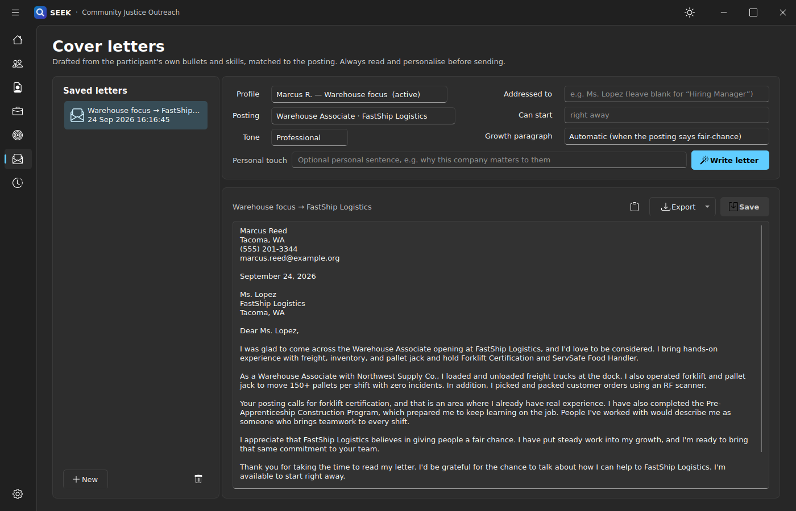
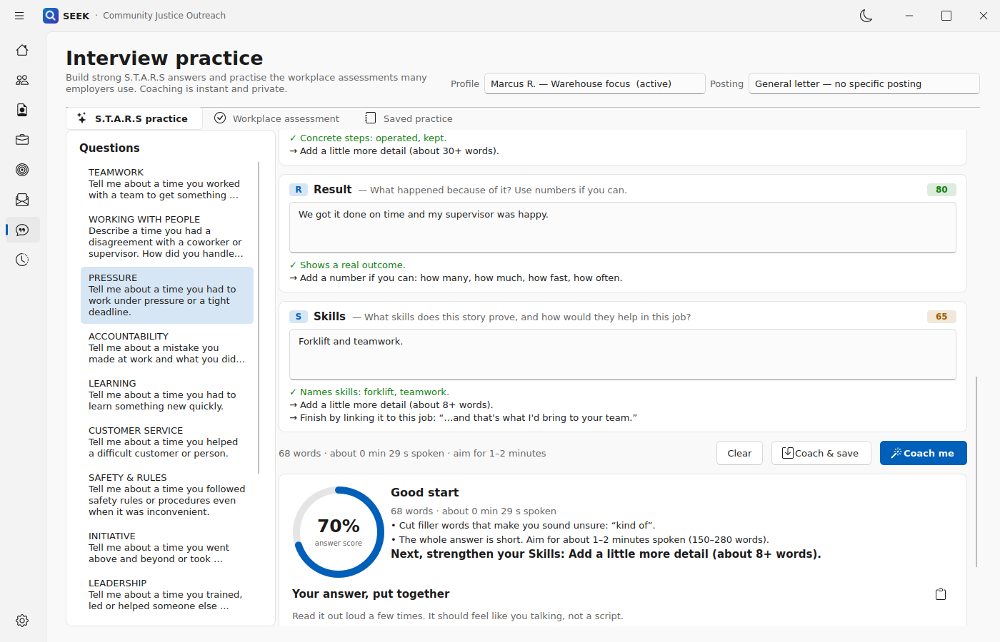
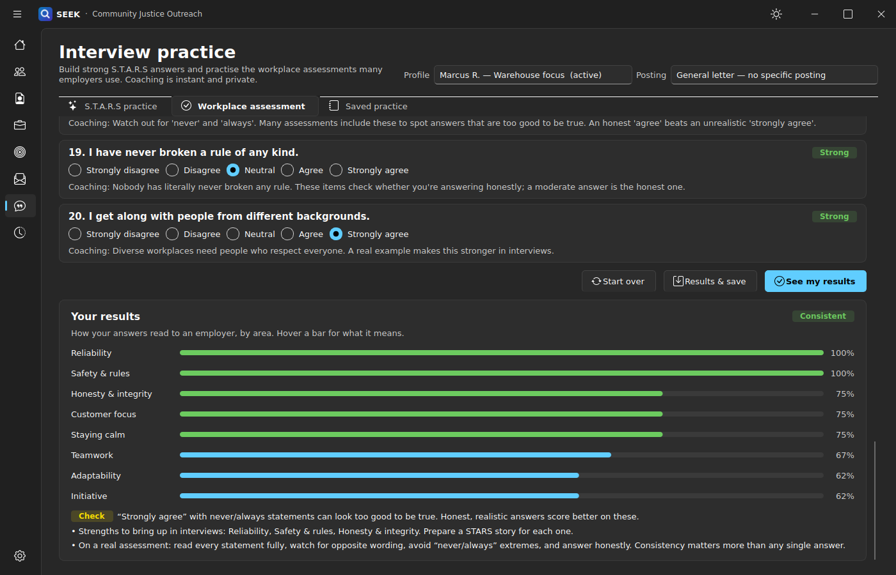

# SEEK v2 — job-readiness toolkit for justice outreach

SEEK helps outreach staff and the people they work with turn real experience into strong applications. That
includes experience from correctional industries, kitchen crews, vocational programs and reentry work.
Everything runs **locally**; participant data never leaves the computer.



## What it does

| | |
|---|---|
| **Multiple profiles** | Keep many participants, each with several resume profiles ("Warehouse", "Kitchen"…), grouped by participant. Duplicate a profile to tailor it; mark one active. |
| **Resume builder** | Three templates (Classic, Modern, Compact) with a live preview. Export to PDF, Word, HTML, plain text (for online forms) or Markdown. |
| **AI coaching (spaCy)** | Scores the resume and reviews every bullet (action verb? numbers? weak opener?). Suggests skills the experience already demonstrates. |
| **Job posting import** | Paste a link: SEEK reads the posting (schema.org JSON-LD or page text), extracts ranked keywords, and flags *fair-chance*, background-check, drug-screen and exclusion language. Sites that block automated reading (Indeed) open in a built-in browser and import from there; paste the description as a last resort. |
| **Keyword optimizer** | Match score against a posting, what's covered, what's missing, and the most relevant bullets. Tailors honestly: only confirmed skills are added, and the result saves as a new profile by default. |
| **Cover letter writer** | Letters built from the participant's own best-matching bullets, skills and credentials. Choose Professional, Warm or Direct tone, and optionally add a growth paragraph that never mentions a record. Edit, save, and export to PDF, Word or text. |
| **Interview practice** | **S.T.A.R.S** (Situation, Task, Action, Result, Skills) answers for 12 behavioral questions, or your own. Includes story ideas pulled from the profile and part-by-part spaCy coaching ("I" vs "we", concrete steps, numbers, filler words, blame words, skills tied to the posting). Produces a polished answer to rehearse. **Workplace assessment** practice has 20 agree/disagree statements like those in hourly-job applications, with coaching as you answer, trait bars, and flags for contradictions and too-good-to-be-true answers. |
| **Fair-chance review** | Flags wording that leads with the setting ("Correctional Facility", "inmates") instead of the skill, with skill-first alternatives. Detects employment gaps and includes staff guidance. |
| **Activity log** | A durable history of everything done, for case notes and program reporting. |

<p>






</p>

## How it's built

A **Qt 6 / C++ shell** owns the whole UI. It follows the look of the QWidget-FancyUI demo in `QWidget-FancyUI/`:
Fluent-style frameless window, icon sidebar, hero banner, light and dark themes. The **Python engine pack**
does all the work with **spaCy**. The two talk only through `seek_cpp_bridge.py` (stdin/stdout JSON lines).

```
shell/            C++ Qt 6 Widgets app (CMake)
python-backend/   seek_cpp_bridge.py + seek/ engines (spaCy, resume, jobs, optimizer, letters, fair-chance)
docs/             ARCHITECTURE.md, BRIDGE_CONTRACT.md, screenshots
scripts/          setup_backend.(ps1|sh), build_windows.ps1
QWidget-FancyUI/  reference build of the UI style SEEK follows (unchanged)
```

* [docs/ARCHITECTURE.md](docs/ARCHITECTURE.md): layers, ownership, data, NLP, fair-chance design
* [docs/BRIDGE_CONTRACT.md](docs/BRIDGE_CONTRACT.md): the complete C++ ↔ Python contract and method list

## Getting started

**You need:** Python 3.10+, Qt 6.4+ (Widgets and Svg, plus the **Qt WebEngine** component for importing from Indeed and other sites that block automated reading), CMake 3.16+, and a C++17 compiler.

### Windows

```powershell
# 1. Build the shell and package it into .\dist (also sets up the Python engine there)
.\scripts\build_windows.ps1 -QtDir C:\Qt\6.7.2\msvc2019_64
# 2. Run
.\dist\SEEK.exe
```

### Linux / macOS

```bash
scripts/setup_backend.sh                    # venv + requirements + spaCy model
cmake -S shell -B shell/build -DCMAKE_BUILD_TYPE=Release
cmake --build shell/build -j
shell/build/SEEK                            # finds ../python-backend automatically
```

On Debian/Ubuntu, install Qt with `sudo apt install qt6-base-dev qt6-svg-dev qt6-webengine-dev libgl1-mesa-dev`.

### Engine only (no GUI)

```bash
cd python-backend
pip install -r requirements.txt && python -m spacy download en_core_web_sm
python seek_cpp_bridge.py --no-qt --call system.status
```

## A typical session

1. **Profiles → New profile.** Enter the participant and profile name, then fill in Basics, Experience,
   Certifications and Training. Program work counts as experience.
2. **Resume builder.** Check the preview, work through the **Coach** tab (weakest bullets are listed first), and
   review the **Fair-chance** tab.
3. **Job postings.** Paste the link and click *Import from link*. Status tracking goes from Saved to Hired.
4. **Match with a profile.** Tick only the skills the participant really has, then click *Apply* to create a
   tailored copy.
5. **Write cover letter.** Pick a tone, add a personal sentence, generate, edit, and export.
6. **Interview practice.** Pick a question, click *Use* on a story idea, write the five S.T.A.R.S parts, and click
   *Coach me* until it's interview-ready. Then run the workplace assessment practice.

## Configuration

| Setting | Where |
|---|---|
| Theme, window frame, organization name | Settings |
| Python interpreter, data folder | Settings → Engine, or `SEEK_PYTHON` / `SEEK_DATA_DIR` |
| Engine folder | `SEEK_BACKEND_DIR` (packaged builds use `python-backend/` next to the exe) |
| spaCy model | `SEEK_SPACY_MODEL` (default `en_core_web_sm`) |
| OS window frame | `SEEK_NATIVE_FRAME=1` |

## Tests

```bash
cd python-backend && python -m pytest -q
```

The tests cover profiles, resume rendering and export, coaching, the fair-chance review, job parsing
(JSON-LD and HTML), the optimizer, cover letters and history. They also drive the real bridge process over
stdio, exactly as the shell does.

## License and credits

GPL-3.0 (see `LICENSE`). The UI design follows [QWidget-FancyUI](https://github.com/COLORREF/QWidget-FancyUI)
(GPL-3.0). Icons are from [Bootstrap Icons](https://icons.getbootstrap.com/) (MIT). NLP is by
[spaCy](https://spacy.io/) (MIT).
